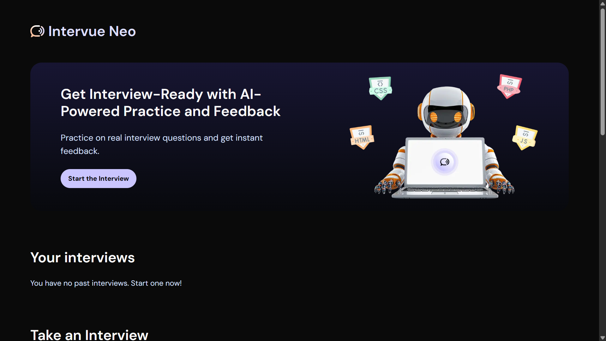

# Rishabh Kartik | Creative Developer Portfolio

A high-performance, meticulously animated personal portfolio website. Built to showcase full-stack projects, engineering experience, and UI/UX design capabilities with a good focus on premium micro-interactions, smooth typography, and clean architecture.

 ## ✨ Key Features

* **Cinematic Animations:** Custom-built Framer Motion wrappers for staggered text, smooth page reveals, and viewport-triggered scroll effects.
* **Premium Micro-interactions:** Magnetic buttons and social icons that physically react to cursor movement for an agency-level feel.
* **Responsive Architecture:** Flawless CSS Grid and Flexbox layouts that adapt seamlessly from ultrawide monitors to mobile devices.
* **Functional Contact Pipeline:** Secure, serverless email integration using Next.js Route Handlers and the Resend API.
* **Infinite Marquee:** A mathematically perfect, continuously looping tech-stack carousel.

## 🛠 Tech Stack

* **Framework:** [Next.js](https://nextjs.org/) (App Router)
* **Styling:** [Tailwind CSS](https://tailwindcss.com/)
* **Animations:** [Framer Motion](https://www.framer.com/motion/)
* **Icons:** [Lucide React](https://lucide.dev/)
* **Email Service:** [Resend](https://resend.com/)
* **Deployment:** [Vercel](https://vercel.com/)